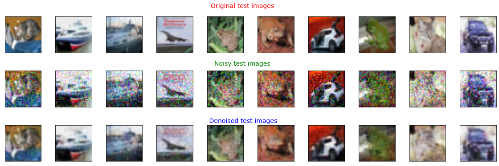

# Image-Denoising-using-Autoencoders with skip connections

## Architecture

The basic architecture used for the denoising is a fully convolutional auto-encoder. The network has two main parts: 

(a) **Encoder** - A sequence of  3x3 convolutional layers followed by Pooling, Batch Normalization layer and a ReLU non-linearity layer. which compresses the input image into a lower dimensional latent representation. Encoder acts as a feature extractor.

(b) **Decoder** - A sequence of deconvolutional layers symmetric to the convolutional layers which reconstructs the input images by decoding (up-sampling operation) the low-dimensional encoded images. 

The corresponding encoder and decoder layers are connected by shortcut connections (skip connections). The main idea behind using the shortcut connections are used to pass feature maps forwardly

## Noise Type

In this project,  the images were corrupted with **Pixel-level Gaussian noise** for training and testing. In this Pixel-level Gaussian noise, given an image x, a random Gaussian noise with mean 0 and standard deviation &sigma is added to each pixel uniformly

## Results:

The original test images, noised test images and the denoised reconstructed test images obtained by the network are shown in the figure below

